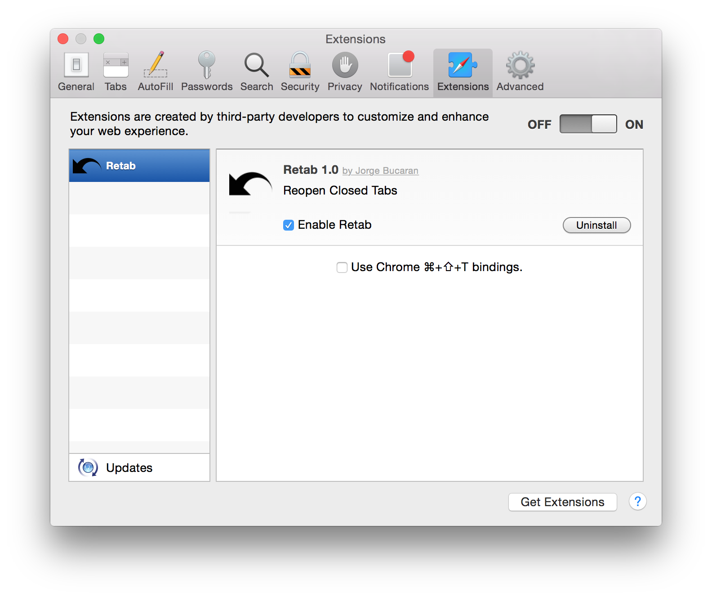

# _retab_
> Reopen Closed Tabs in Safari

In Safari you can _<kbd>⌘</kbd> + <kbd>z</kbd>_ to reopen the last closed tab, but it seems to fall short of _undo_ as it only works for one tab. With _retab_ you can reopen as many as _20_ closed tabs.

## Install

Download the extension bundle [**here**][bundle], double click, confirm and you will be reopening closed tabs in no time. Alternatively, you can [download][zip] the source and build it yourself. You will need to [register](https://developer.apple.com/programs/safari/) for the Safari Developer Program. (Free)

## Key bindings

_retab_ uses _<kbd>⌘</kbd> + <kbd>z</kbd>_ by default, but Chrome-_style_ _<kbd>⌘</kbd> + <kbd>⇧</kbd> + <kbd>T</kbd>_ is also available via Settings.

## Requests
If you have any requests or issues with this software, please [open an issue][issues] and you will be promptly served. You are also welcome to submit a patch or pull a request with that feature you like.

## FAQ
1. Why only 20 tabs?
There is no numeric spinner available via settings in Safari. Using any other UI component would be too cumbersome. 20 seems like a fairly large number of tabs. For instance, Chrome remembers up to 10. We can double that.

## License

[MIT](http://opensource.org/licenses/MIT) © [Jorge Bucaran](http://bucaran.me)

[bundle]: https://github.com/bucaran/retab/blob/master/retab.safariextz?raw=true
[zip]: https://github.com/bucaran/retab/archive/master.zip
[issues]: https://github.com/bucaran/retab/issues
